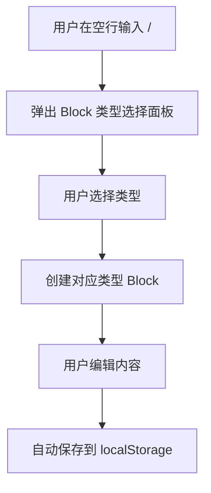
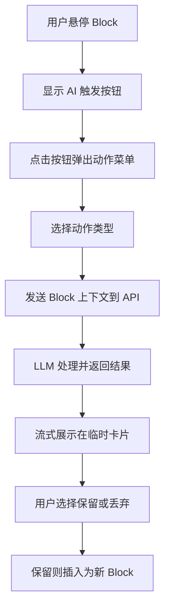
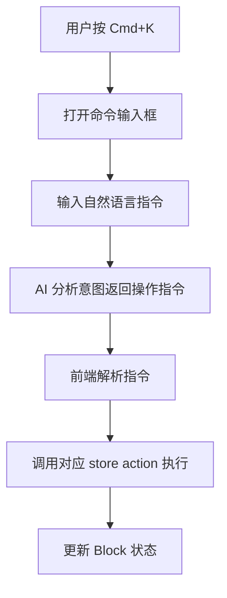
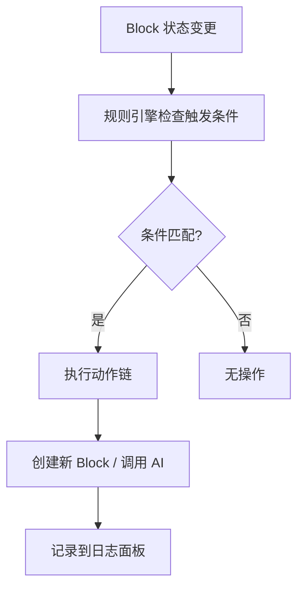

# BlockOS 产品需求文档

## 1. 产品概述

BlockOS 是一个 AI 原生的知识操作系统，以 Block（块）为信息原子，打破传统"文件"概念，让信息可自由组合、AI 渗透每个单元、文档能主动行动和自我演化。

目标用户：知识工作者、产品经理、开发者、研究者等需要高效处理结构化信息的人群。

## 2. 核心功能

### 2.1 功能模块

1. **Block 编辑器**：自由排列的不同类型信息块，支持 `/` 命令创建、拖拽排序、多选批量操作
2. **AI 深度融合**：单 Block 智能动作（总结/扩展/改写）、跨 Block 综合总结、AI 命令模式（自然语言操控编辑器）
3. **动态关系网络**：Block 间双向链接（`@引用`）、反向链接列表、关系视图面板
4. **Agent 规则引擎**：预设触发规则，让文档在特定条件下自动执行操作

### 2.2 页面详情

| 页面名称 | 模块名称 | 功能描述 |
|---------|---------|---------|
| 主编辑器页面 | Block 画布 | 展示所有 Block，支持自由编辑、拖拽、多选 |
| 主编辑器页面 | `/` 命令菜单 | 空行输入 `/` 弹出类型选择面板 |
| 主编辑器页面 | AI 动作菜单 | Block 悬停时右侧出现 AI 触发按钮 |
| 主编辑器页面 | 批量操作栏 | 多选状态下提供删除、复制 ID 等操作 |
| 主编辑器页面 | 关系视图抽屉 | 侧边面板展示所有链接关系 |
| 主编辑器页面 | Agent 日志面板 | 显示最近自动操作记录 |
| 主编辑器页面 | Cmd+K 命令面板 | 自然语言输入指令操控编辑器 |

## 3. 核心流程

### 3.1 Block 创建与编辑流程

### 3.2 AI 单块动作流程

### 3.3 AI 命令模式流程

### 3.4 Agent 规则触发流程

## 4. 用户界面设计

### 4.1 设计风格

- **主题**：深色主题为主，营造沉浸式知识工作环境
- **主色**：`#0f0f0f`（背景）、`#1a1a1a`（卡片）、`#2a2a2a`（悬停）
- **强调色**：`#3b82f6`（蓝色，AI 相关）、`#10b981`（绿色，成功/Agent）
- **字体**：系统字体栈，等宽字体用于代码块
- **布局**：全屏画布，顶部工具栏，左侧边缘拖拽手柄，右侧 AI 按钮
- **图标**：lucide-react 图标库

### 4.2 页面设计概览

| 页面名称 | 模块名称 | UI 元素 |
|---------|---------|---------|
| 主编辑器页面 | 顶部工具栏 | Agent 规则开关、日志面板按钮、标题 |
| 主编辑器页面 | Block 画布 | 垂直排列的 Block 列表，每个 Block 有左侧拖拽手柄和右侧 AI 按钮 |
| 主编辑器页面 | `/` 命令菜单 | 悬浮面板，显示 Block 类型图标和名称 |
| 主编辑器页面 | AI 动作菜单 | 悬浮面板，显示动作列表 |
| 主编辑器页面 | 临时结果卡片 | 流式输出展示，底部有保留/丢弃按钮 |
| 主编辑器页面 | 关系视图抽屉 | 从右侧滑出，显示链接关系列表 |
| 主编辑器页面 | Agent 日志面板 | 从顶部滑出，显示最近 5 条记录 |

### 4.3 响应式设计

- 桌面优先设计
- 最小宽度 1024px
- 不做移动端适配（明确边界）

## 5. Block 类型设计

### 5.1 支持的 Block 类型

| 类型 | 渲染方式 | AI 动作 |
|-----|---------|---------|
| text | contentEditable 编辑，支持 Markdown 快捷语法 | 总结、改写（正式/随意） |
| todo | checkbox + 内联文本 | 拆解子任务 |
| list | 有序/无序列表 | 生成思维导图大纲 |
| code | 带语法高亮的代码展示 | 解释代码、优化建议 |
| table | 简单的网格表格 | 数据洞察 |

### 5.2 Block 视觉样式

- 每个 Block 有统一的圆角边框（`rounded-lg`）
- 悬停时显示左侧拖拽手柄和右侧 AI 按钮
- 选中状态显示蓝色左边框（`border-l-4 border-blue-500`）
- 不同类型 Block 有细微的视觉区分

## 6. 动画与交互

### 6.1 过渡动画

- Block 创建：淡入 + 滑入（framer-motion）
- Block 删除：淡出 + 收缩
- 拖拽排序：平滑的位移动画
- 面板展开/收起：滑动动画

### 6.2 微交互

- 按钮悬停：背景色变化 + 轻微缩放
- AI 流式输出：打字机效果
- Block 选中：蓝色边框闪烁一次
- 链接跳转：目标 Block 高亮闪烁
