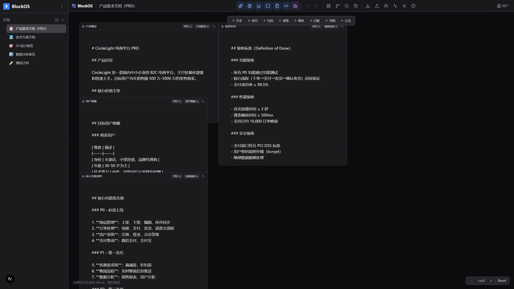
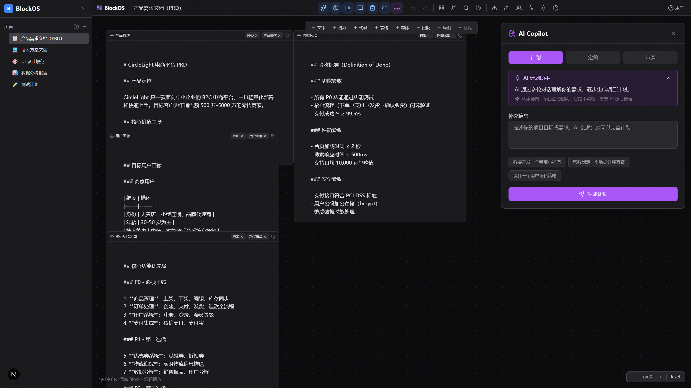
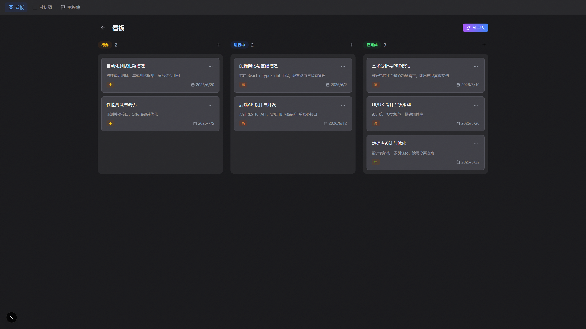
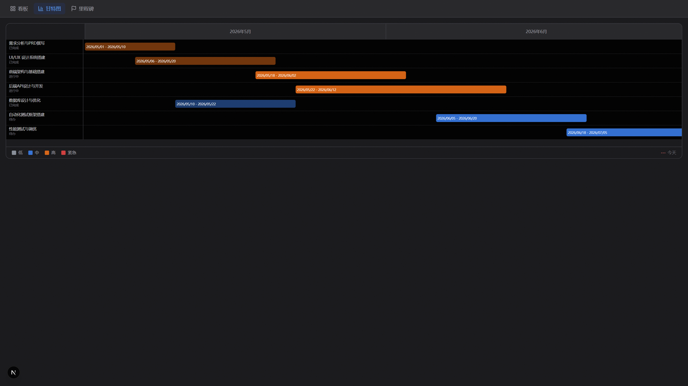
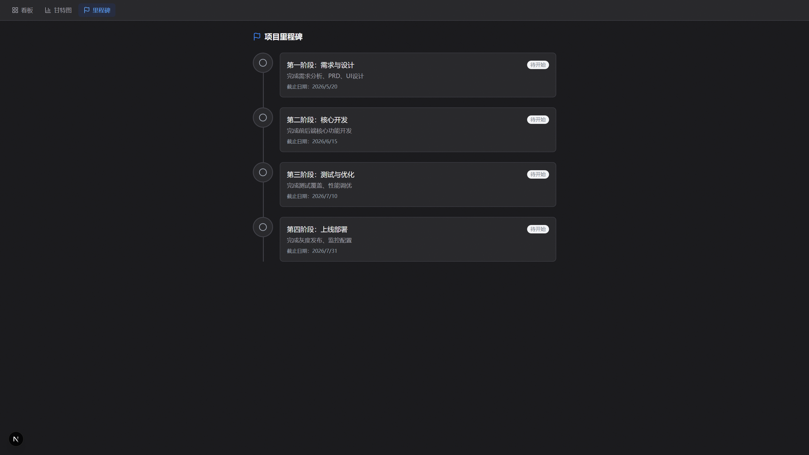
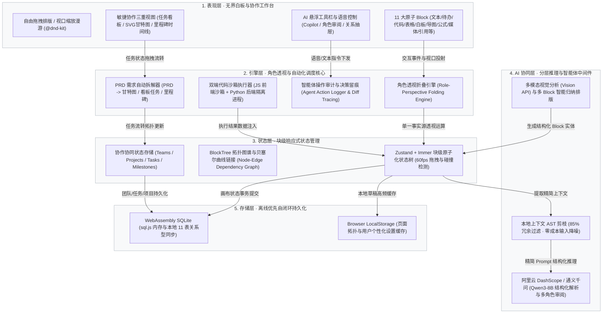

# 🌟 BlockOS：AI 原生模块化知识协作操作系统 (Next-Gen Unbounded Knowledge OS)

<div align="center">

[](#-赛道背景与设计哲学)
[](https://nextjs.org/)
[](https://react.dev/)
[](https://www.typescriptlang.org/)
[](https://zustand-demo.pmnd.rs/)
[](LICENSE)

**打碎传统文件线性容器，融汇「Notion × Jira × Linear」的 AI 原生多角色协作操作系统**  
`(agent + md) × ai + html` —— 将 AI 从侧边栏对话框升级为贯穿需求梳理、看板敏捷流转与甘特图排期的全能产研副驾

> **参赛团队**：曹琅 · 杜诺琦 · 伍菲琪  
> **所属赛道**：FDoc 创新竞赛「赛道四 · 无界文档 π（半命题）」官方最终汇总版

[设计哲学](#-赛道背景与设计哲学) • [七大核心功能体系](#-七大核心功能体系全景) • [真机运行效果](#-真机真实运行视觉闭环) • [系统架构](#-系统架构与分层拓扑) • [架构决策 (ADR)](#-架构决策记录-adr) • [快速开始](#-快速开始与本地复现)

</div>

---

## 💡 赛道背景与设计哲学

本项目为 **FDoc 创新竞赛「赛道四 · 无界文档 π（半命题）」** 官方团队最终汇总版参赛作品。

传统软件产研协作长期面临三座难以逾越的高墙：
1. **单体长文本撕裂多角色视角**：一份包含 PRD、UI 规范、前后端架构、测试用例的数十页文档，不同角色只能在海量文字中低效翻找；拆分为多个独立文件又会陷入“信息同步地狱”；
2. **计划书到工程执行断层**：产品经理输出 PRD 后，研发负责人需手动逐行拆解任务、建看板、排甘特图、指派成员，不仅费时耗力且极易遗漏关键依赖；
3. **AI 能力停留在浅层外挂**：市面多数产品仅在右侧嵌一个聊天框，AI 无法感知知识网络的网状拓扑，无法直接在画布上创建实体并驱动业务闭环。

### 核心哲学公式：`(agent + md) × ai + html`
BlockOS 彻底打破传统“单体文件”观念，构建以 **Block 为原子信息单元、AI 为原生乘数因子、Agent 为自主行动层** 的操作系统：
- **`md` (Markdown)**：所有知识单元以结构化 Markdown 存储，保证跨平台高迁移性与单一事实源；
- **`agent` (自主行动规则)**：文档不再是被动阅读的静态死物，内置事件触发（如勾选待办自驱动记录日志与通知）；
- **`ai` (环境乘数因子)**：AI 不是与 Agent 或 MD 平行的外挂，而是**乘入整个系统的“倍率因子”**，渗透在每个 Block 的理解、推理与排期中；
- **`+html` (开放渲染层)**：基于 Web 标准（React 19 + TailwindCSS + @dnd-kit），赋予任意 Block 自由拖拽、缩放、组合与实时渲染能力。

---

## 📸 真机真实运行视觉闭环

> 本项目所有展示截图均在本地真实服务下由 Chrome 1920×1080 视口直接截取，杜绝纸面概念推演。

### 1. 无界原子画布全景（Unbounded Infinite Canvas）
彻底打碎长文线性排版，支持 11 大原子 Block（文本、待办、代码、表格、手绘白板、思维导图、LaTeX 公式等）自由拖拽排版与多维连线。


### 2. AI 产研副驾工作台（AI Copilot Panel）
支持「计划 Plan - 定稿 Finalize - 审阅 Review」全周期，AI 通过多轮智能追问厘清模糊诉求，直接在画布上实例化为成套关联 Block 矩阵。


### 3. 多维敏捷任务看板（Agile Kanban Board）
支持 3 列拖拽流转、低/中/高/紧急 4 级优先级、截止时间、任务评论与 DoD（验收标准），支持从 PRD 一键 AI 导入任务。


### 4. 自研 SVG 敏捷甘特图（Gantt Chart Engine）
时间线横道图、自动计算周数、实时“今天”红线标记、任务状态与优先级色彩编码、自适应响应式容器。


### 5. 项目里程碑时间线（Milestone Timeline）
追踪产品全生命周期关键节点，支持阶段目标管理与状态可视化。


---

## 🚀 七大核心功能体系全景

### 1. 🧩 11 种全能原子级 Block 体系
| Block 类型 | 核心能力与工程细节 |
|---|---|
| **Text (富文本)** | 字体大小/粗细/颜色/高亮/排版，支持 Markdown 实时双向同步 |
| **Todo (待办事项)** | 复选框流转，**勾选可触发底层 Agent 自动生成日志与鼓励通知** |
| **Code (可执行代码块)** | 26 种编程语言高亮 (PrismJS)，**双端沙箱运行**（前端 JS 沙箱 + 后端 Python 隔离执行，支持 `// @ref` 跨 Block 变量引用） |
| **Table (多维表格)** | 6 种列类型（文本/数字/日期/下拉选择/复选框/链接），支持聚合计算与数据洞察 |
| **Whiteboard (手绘白板)** | 矢量手绘画布、笔刷/橡皮擦、自定义调色盘、支持导出高清 PNG |
| **Mindmap (思维导图)** | 树状导图节点动态增删改、折叠展开，**支持 AI 一键发散扩展子节点** |
| **Math (数学公式)** | 内置 KaTeX 高性能实时排版，支持复杂科研与工程公式渲染 |
| **Media (富媒体)** | 支持本地 Base64 上传预览与图文配图描述 |
| **Quote / Toggle / Divider** | 引用卡片、手风琴折叠展开块、视觉分割线 |

### 2. 🎨 自由无限二维白板系统
- **视口漫游**：无限平移与 Ctrl+滚轮平滑缩放，点阵网格辅助对齐；
- **编组管理 (Group)**：多选 Block 自由创建 group，组内整体移动与嵌套；
- **父子层级树**：支持 Block 树状嵌套归属与一键递归折叠；
- **贝塞尔曲线依赖图谱**：任意 Block 之间支持创建动态逻辑连线，呈现网状依赖图谱；
- **标签轮盘 (TagWheelPicker)**：交互式滚轮打标系统与对齐吸附；
- **框选交互**：鼠标长按拖动画布框选多个 Block 进行批量移动或属性修改。

### 3. 🤖 AI 智能体与副驾协同体系
- **AI 产研副驾 (Copilot)**：计划（Plan）、定稿（Finalize）、审阅（Review）三阶闭环，自主将需求转化为画布实体；
- **角色透视折叠引擎 (Role-Perspective Folding Engine)**：**单一事实源零篡改**，按产品经理、UI 设计师、前端、后端、测试 5 大职能自适应投影折叠，消除阅读噪音；
- **Block 专属 AI 动作**：文本总结/改写/扩写，代码解释/重构优化，表格数据洞察，白板生成说明；
- **AI 命令面板 (Command Palette)**：支持自然语言操作与 **Web Speech 语音实时指令输入**；
- **智能体审计留痕 (Agent Log & History)**：任何 AI 介入或自动化规则触发均打上数字指纹，支持差异对比与时光机回滚。

### 4. 📊 敏捷项目与团队协作管理 (Notion × Jira × Linear)
- **多级团队权限 (RBAC)**：支持 Owner / Admin / Member 角色细粒度隔离；
- **项目空间管理**：项目状态归档、专属主题色彩与图标定制；
- **三列敏捷看板**：待办 / 进行中 / 已完成拖拽流转，含 DoD 验收标准与任务级评论区；
- **自研 SVG 甘特图**：起止时间精确到天、周数自动演算、实时今天基准红线、按优先级色彩编码；
- **阶段里程碑**：待开始 / 进行中 / 已完成时序卡片。

### 5. ⚡ AI PRD 一键拆解流水线 (PRD-to-Execution Pipeline)
- 粘贴任意 Markdown 需求规格说明书；
- AI 自动抽离项目工程阶段、任务优先级与工时评估；
- **自动匹配 5 人预设产研团队职能**：
  - **陈明远** (产品经理 · admin@circlelight.com)
  - **林小薇** (前端开发 · linxiaowei@circlelight.com)
  - **张浩然** (后端开发 · zhanghaoran@circlelight.com)
  - **苏婉清** (UI 设计师 · suwanqing@circlelight.com)
  - **王志强** (测试工程师 · wangzhiqiang@circlelight.com)
- 一键生成甘特图时间线、看板任务卡片与优缺点审查报告。

### 6. 📚 企业级知识库与页面流转
- **6 套实战模板**：CircleLight 电商 PRD、会议纪要、项目计划、读书笔记、技术周报、空白画布；
- **多向导入导出**：支持导出 Markdown / HTML / PDF / Word，支持导入 Markdown / CSV 转表格 / 图片转媒体；
- **多级文件夹管理**：页面分类归档、拖拽移动与图标配置；
- **历史快照回溯**：自动保存最近 50 条变更记录，支持完整的原子级 Undo / Redo；
- **关系图谱抽屉**：分析正向链接、反向链接、链接密度与知识拓扑分布。

### 7. 💾 轻量高性能混合持久化架构
- **零外部重量级数据库依赖**：采用 `sql.js`（WebAssembly SQLite）在浏览器和 Node 端自闭环运行，内置 11 张标准化关系型数据表；
- **极速响应**：`Zustand + Immer` 驱动画布状态，保障 60fps 极速拖拽与局部精细化渲染；
- **离线即用**：开箱即用，即便无外网环境亦可完整运行除模型推理外的所有协同与排期功能。

---

## 🏛️ 系统架构与分层拓扑



---

## 🛡️ 架构决策记录 (ADR)

本项目根目录下统一维护完整的架构决策日志 [DECISIONS.md](DECISIONS.md)，核心要点如下：

1. **[ADR-001] 范式颠覆**：打碎“文件”概念，以 `(agent + md) × ai + html` 构建模块化知识操作系统；
2. **[ADR-002] 角色透视折叠引擎**：坚持“单一事实源零篡改”，通过元数据标签与折叠算子按 PM/UI/FE/BE/QA 呈现多重视角，杜绝副本分裂；
3. **[ADR-003] 双模智能体协同**：Copilot 具备“计划-定稿-审阅”独立画布操作能力，变更全量记录数字指纹用于审计溯源；
4. **[ADR-004] 混合持久化选型**：摒弃重型远程数据库依赖，采用 `Zustand + Immer` 结合 `sql.js`（WASM SQLite），实现零摩擦极速部署与离线可用；
5. **[ADR-005] 算力防御与 ROI 治理**：前置本地静态规则与 AST 剪枝过滤 85% 冗余文本，大模型按需触发，降低 Token 成本并防止界面阻塞。

---

## 📂 项目工程目录结构

```text
BLOCKOS-with-taoke/
├── FDoc-赛道四-曹琅+杜诺琦+伍菲琪_说明文档(1).pdf # 竞赛官方申报完整设计说明书
├── src/
│   ├── app/                      # Next.js 15 App Router 路由体系
│   │   ├── api/                  # AI 流水线、工作流分析、鉴权与团队 API
│   │   ├── projects/[projectId]/ # 敏捷项目看板、自研 SVG 甘特图与里程碑视图
│   │   ├── teams/                # 团队组织架构与成员角色权限管理
│   │   ├── login/                # 预设 Demo 账号一键快捷登录与鉴权
│   │   └── page.tsx              # 主工作空间挂载入口
│   ├── components/               # 核心 React 表现层组件
│   │   ├── BlockEditor.tsx       # 无限白板画布、拖拽吸附与碰撞检测
│   │   ├── Toolbar.tsx           # 顶部工具栏与 AI 能力触发中心
│   │   ├── CopilotPanel.tsx      # AI 产研副驾独立操作面板 (计划/定稿/审阅)
│   │   ├── FoldPlanPanel.tsx     # 角色透视折叠规划面板
│   │   ├── AgentLogPanel.tsx     # 智能体行动日志与决策留痕抽屉
│   │   ├── CommandPalette.tsx    # 自然语言与 Web Speech 语音命令面板
│   │   ├── RelationDrawer.tsx    # 知识网络与贝塞尔曲线依赖抽屉
│   │   └── collaboration/        # 甘特图、看板与团队协同专属组件
│   ├── store/                    # 全局状态管理
│   │   ├── blockStore.ts         # Zustand + Immer 块级原子化状态树
│   │   └── collaborationStore.ts # 团队、任务与时间线协同状态
│   ├── lib/                      # 底层核心库
│   │   ├── db.ts                 # WebAssembly SQLite (sql.js) 11 张数据表管理
│   │   ├── auth-utils.ts         # 会话与角色权限解析工具
│   │   └── ai/                   # 大模型客户端接入与容错解析器
│   └── types/                    # TypeScript 类型定义字典
├── tests/                        # Vitest 自动化测试套件 (覆盖 165+ 测试用例)
├── docs/
│   ├── assets/                   # 真机运行高清截图素材库
│   ├── features-overview.md      # 功能全景明细规范文档
│   └── BlockOS-参赛说明文档.md    # 竞赛申报详细设计说明书
├── DECISIONS.md                  # 跨项目通用架构决策推演记录
└── README.md                     # 项目技术全景说明文档
```

---

## ⚡ 快速开始与本地复现

### 1. 环境准备
- Node.js 18.18.0 或更高版本
- 推荐使用 npm 或 pnpm

### 2. 安装与运行
```bash
# 1. 克隆仓库并进入目录
git clone https://github.com/akkomylove/BLOCKOS-with-taoke.git
cd BLOCKOS-with-taoke

# 2. 安装项目依赖
npm install

# 3. 启动本地开发服务 (Turbopack 极速模式)
npm run dev -- -p 3000
```
启动后在浏览器中访问 `http://localhost:3000` 即可直接进入无界知识空间；访问 `http://localhost:3000/login` 可直接使用预设的 5 人产研团队账号一键登录。

### 3. 配置可选的大模型服务
如需体验在线 AI 角色审阅与 PRD 智能拆解，可创建 `.env.local`：
```env
SILICONFLOW_BASE_URL=https://dashscope.aliyuncs.com/compatible-mode/v1
SILICONFLOW_API_KEY=sk-你的阿里云密钥
AI_MODEL=qwen3-8b
AUTH_SECRET=blockos-secret-token-demo
```
> **注**：在未配置 API Key 的离线环境下，BlockOS 的全部白板排版、Block 拖拽嵌套、代码运行、看板任务与自研 SVG 甘特图均可完整离线运行。

### 4. 运行自动化测试套件
```bash
npm run test:run
```
系统内置 165 项基于 Vitest 的单体与集成测试套件，全面覆盖数据模型、权限校验与组件交互。
